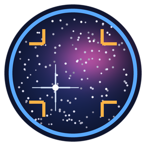
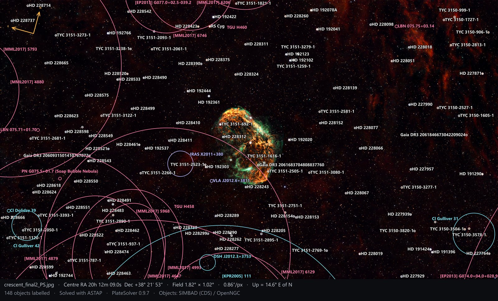

<p align="center"></p>

<h1 align="center">PlateSolver</h1>

<p align="center">
Find out where in the sky your picture was taken – and what is in it.<br>
Free and open source for Windows, macOS and Linux · GPL-3.0-or-later
</p>

PlateSolver plate solves your astrophotos and shows every galaxy, nebula, star cluster and bright star in
them, with its distance and true size in light-years. It works with telescope images, camera-lens Milky Way
shots and even phone photos – no experience with astronomy software needed.



<sub>The Crescent Nebula (NGC 6888) in Cygnus, solved with ASTAP and annotated by PlateSolver (File › Export annotated image).</sub>

## What it does

- **Opens** FITS, XISF (PixInsight), TIFF, JPG, PNG and HEIC (iPhone) images.
- **Plate solves** them with [ASTAP](https://www.hnsky.org/astap.htm) on your own computer, or online with
  [astrometry.net](https://nova.astrometry.net). Images that already contain a solution open solved.
- **Labels the objects** in the image from SIMBAD, OpenNGC and HyperLeda. Point at an object for an
  information card; double-click it to read about it on Wikipedia or SIMBAD.
- **Distances and sizes** in light-years, with the number of decimals you choose, and when the light left.
- **Visible stars first:** finds the stars you can actually see in the image and labels them, and dims
  objects too faint to show.
- **Overlays:** RA/Dec grid, constellation figures and names, and a north/east compass.
- **Equipment profiles** for telescopes, DSLR and mirrorless cameras, smartphones and photos of a screen,
  chosen automatically from the image's own camera information.
- **Help for difficult images:** object hints ("this is M101"), uneven backgrounds, a starless-image check,
  phone and wide-field aids, lens distortion correction, and **Crop and rotate** to solve only part of an image.
- **Export** an annotated image, the object list (CSV) or the plate solution (.wcs, or into the FITS header),
  and **batch solve** whole folders.
- A built-in manual, and two astronomy quizzes with 1,000 questions each.

## Download

Get the latest version from **[Releases](../../releases)**.

| System | Download | Notes |
|---|---|---|
| Windows 10/11 | `PlateSolver-<version>-windows.zip` | Unzip and run `PlateSolver.exe`. The app is not code-signed: if Windows says "Windows protected your PC", click *More info* › *Run anyway*. |
| macOS | coming soon | Until then, run it from the source (below) or build the app yourself. |
| Linux | coming soon | Until then, run it from the source (below) or build the app yourself. |

Installation guides in English and Swedish are attached to the releases.

### You also need ASTAP

PlateSolver uses **ASTAP** by Han Kleijn to solve images on your own computer. ASTAP is free but not included.
PlateSolver's **Tools › Install ASTAP and star databases…** helps you download and install it, or get it from
[hnsky.org/astap.htm](https://www.hnsky.org/astap.htm). Install a star database too: **D50** for most
telescopes, **W08** for camera lenses and phones. Then point PlateSolver at ASTAP in
**Settings › Plate solvers › ASTAP**.

Optionally, add a free [astrometry.net](https://nova.astrometry.net) API key in Settings for online solving
of images that ASTAP can't solve. PlateSolver always asks before it uploads an image.

## Quick start

1. **Tools › Profiles…** – pick a template for your equipment (for example *Astro camera on a telescope*),
   make your own profile from it and enter your camera and focal length.
2. **Open an image** (Ctrl+O, or drag it onto the window).
3. If only part of it shows sky, use **Crop and rotate** (C) first.
4. Press **Solve** (F5).
5. Browse the **Objects** list, point at the labels, and **export** the annotated image with Ctrl+E.

The full manual is in the program (**Help › Manual**, F1) and in [`Manual.html`](Manual.html).

## Running from the source

Needs Python 3.10 or newer ([python.org](https://www.python.org/downloads/)).

- **Windows:** double-click `run.bat`.
- **macOS / Linux:** `bash run.sh`

The first start creates a Python environment in `.venv` and installs the libraries (a few minutes); later
starts are quick. Settings, log file and cache are kept in `%APPDATA%\PlateSolver` on Windows and in
`~/.platesolver` on macOS and Linux.

Run the tests with `python -m pytest tests`, using the Python in `.venv`.

## Building the apps

Stand-alone apps that don't need Python are built with PyInstaller, each on its own system. See
[`build/README.md`](build/README.md).

| System | Command | Result |
|---|---|---|
| Windows | `build\windows\build.bat` | `PlateSolver.exe`, a .zip, and an installer if Inno Setup 6 is installed |
| macOS | `bash build/macos/build.sh` | `PlateSolver.app` and a .dmg |
| Linux | `bash build/linux/build.sh` | a `PlateSolver` folder and a .tar.gz |

## How it is built

A small core plus modules (plugins). The core runs the stages in order and knows nothing about file
formats, solvers or catalogues. Every stage is a module type:

| Module type | Job | Included |
|---|---|---|
| Image format (`ImageLoader`) | Read a file, pull pointing hints from its header | FITS, XISF, TIFF, JPEG/PNG/HEIC |
| Plate solver (`Solver`) | Image → sky coordinates (WCS) | Existing solution in file, ASTAP, astrometry.net (online) |
| Object catalogue (`CatalogProvider`) | Objects inside the solved field | SIMBAD (online), OpenNGC (built in), HyperLeda (ASTAP's hyperleda.csv, optional) |
| Distance source (`DistanceResolver`) | Distance for each object (first that knows wins) | Parallax, published distances (SIMBAD), redshift |
| Information link (`LinkProvider`) | Web pages for an object (first opens on double-click) | Wikipedia (choose language), SIMBAD page |
| Overlay (`OverlayLayer`) | Draw on the image | Object labels, RA/Dec grid, constellations, North/East compass |

```
platesolver/
  core/        interfaces, data models, settings, module registry, pipeline, cache (no Qt)
  services/    clients for SIMBAD and Wikipedia, shared by several modules
  plugins/     built-in modules, one folder per type
  data/        OpenNGC catalogue, star and constellation data, quizzes (see the LICENSE files there)
  help/        the manual (the settings reference is generated from the modules)
  legal/       licence texts and third-party notices shown in the program
  ui/          main window, image view, sidebar, settings, export, batch and help windows
tests/         automated tests (pytest)
tools/         update_openngc.py – refreshes the built-in OpenNGC catalogue
build/         scripts that build the Windows, macOS and Linux apps
```

### Adding a module

Create a `.py` file in `platesolver/plugins/<type>/`, or in the `plugins` folder inside PlateSolver's
settings folder to keep it outside the program. It is found automatically at start-up, and its settings
page is generated from `settings_schema()`.

```python
from platesolver.core.interfaces import OverlayLayer
from platesolver.core.settings import SettingField, STR

class CentreMark(OverlayLayer):
    plugin_id = "centre_mark"
    name = "Centre mark"
    description = "A cross at the image centre."

    def settings_schema(self):
        return [SettingField("color", "Colour", STR, "#ff4040")]

    def render(self, painter, image, solution, objects):
        x, y, c = image.width / 2, image.height / 2, self.setting("color")
        painter.line(x - 30, y, x + 30, y, c)
        painter.line(x, y - 30, x, y + 30, c)
```

Pixel coordinates everywhere are (column, row) with row 0 at the top of the displayed image. Every WCS in
the program uses that convention, so overlays always line up.

## Licence

PlateSolver – Copyright © 2026 Miklos Elmberg

PlateSolver is free software: you can redistribute it and/or modify it under the terms of the GNU General
Public License as published by the Free Software Foundation, either version 3 of the License, or (at your
option) any later version (GPL-3.0-or-later). It is distributed WITHOUT ANY WARRANTY. See [LICENSE](LICENSE).

## Data and credits

PlateSolver uses SIMBAD (CDS, Strasbourg), OpenNGC by Mattia Verga (CC BY-SA 4.0), Hipparcos stars and
constellation data from d3-celestial by Olaf Frohn (BSD-3-Clause), Tycho-2 via VizieR (CDS), HyperLeda,
ASTAP by Han Kleijn, astrometry.net and Wikipedia, and is built with Python, Qt (PySide6, LGPL-3.0),
Astropy, NumPy, Pillow, pillow-heif, tifffile, imagecodecs, lz4, zstandard and openpyxl.
Every component, with its licence, is listed in [THIRD-PARTY-NOTICES.md](THIRD-PARTY-NOTICES.md).
